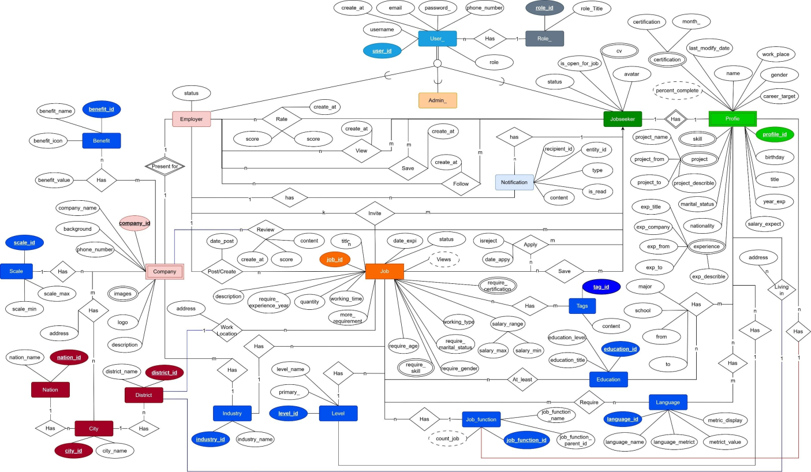
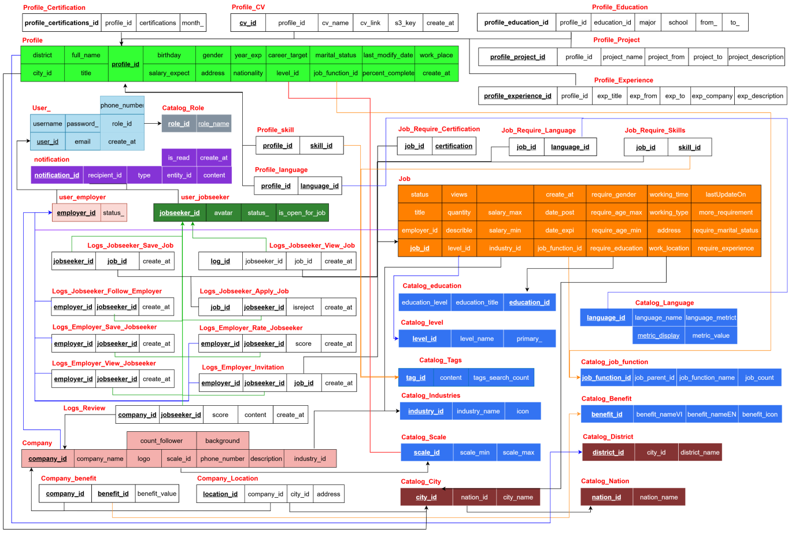
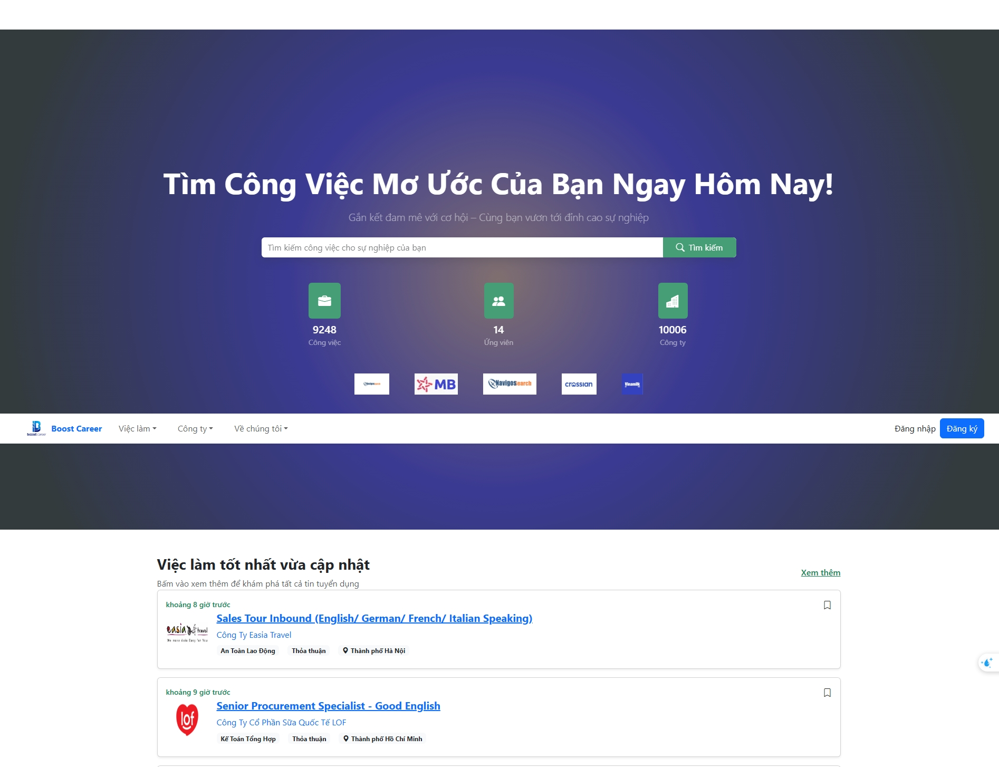
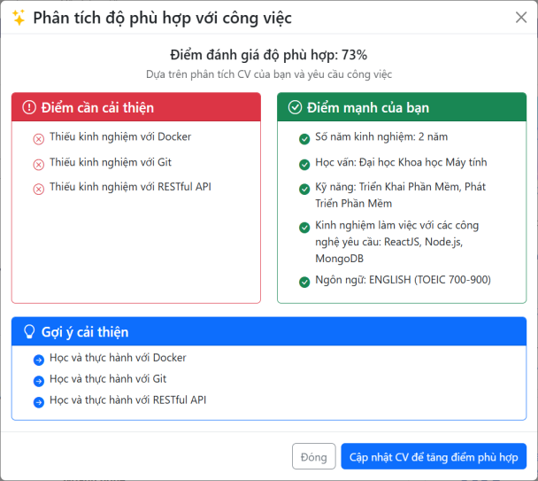
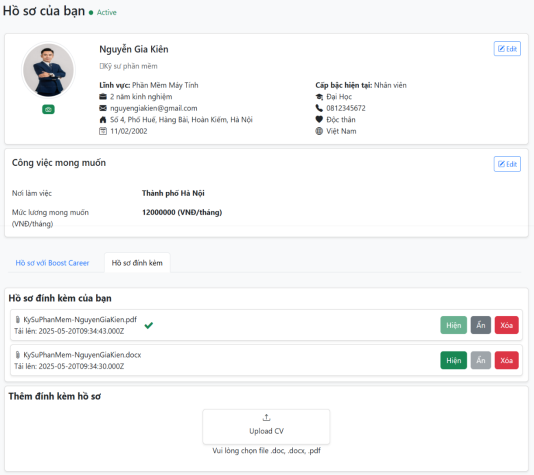
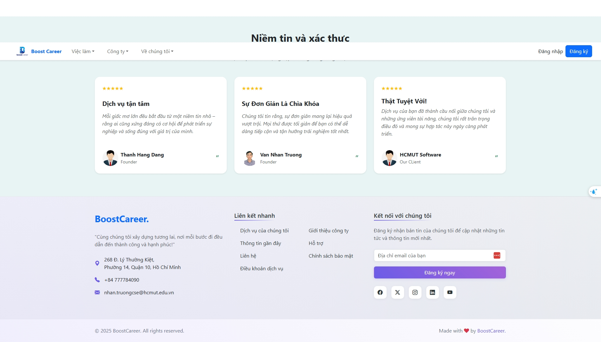

# BoostCareer — Nền tảng tìm kiếm việc làm, tuyển dụng & tư vấn nghề nghiệp tích hợp AI (Đồ án tốt nghiệp)

Demo/Website: https://boostcareer.site  
Tác giả: **Trương Văn Nhân** — nhan.truongcse@gmail.com — https://github.com/nhantruonghcmut

BoostCareer là đồ án tốt nghiệp xây dựng nền tảng kết nối **người tìm việc** và **nhà tuyển dụng**, đồng thời tích hợp AI để phục vụ một số tính năng cho người dùng như **đánh giá mức độ phù hợp CV–Job** và đưa ra **gợi ý cải thiện cho bản thân** để phù hợp với công việc.

---

## Tính năng chính

### 1) Đối với khách (chưa đăng nhập)
- **Tìm việc làm** theo từ khóa
- **Xem việc làm nổi bật**
- **Xem thông tin công ty** và các tin tuyển dụng của công ty
- **Đăng ký / Đăng nhập** để sử dụng các tính năng nâng cao

### 2) Đối với nhà tuyển dụng (Employer)
- **Quản lý tin tuyển dụng**: đăng tin mới với thông tin chi tiết (ngành nghề, lương, yêu cầu,…)
- **Quản lý hồ sơ công ty**: cập nhật tên, địa chỉ, lĩnh vực, quy mô,…
- **Tìm ứng viên** theo kỹ năng/kinh nghiệm phù hợp
- **Xem hồ sơ ứng viên**: xem chi tiết, đánh giá, lưu hồ sơ, gửi thư mời
- **Thông báo hệ thống**
- **Quản lý tài khoản**: đổi mật khẩu, đăng xuất

### 3) Đối với người tìm việc (Job Seeker)
- **Quản lý hồ sơ cá nhân**: cập nhật thông tin cơ bản (họ tên, ngày sinh, email,…)
- **Tìm việc làm** với từ khóa + bộ lọc (ngành nghề, địa điểm, kinh nghiệm, lương,…)
- **Xem chi tiết việc làm & công ty**
- **Quản lý việc làm**: xem việc nổi bật, lưu tin, ứng tuyển bằng hồ sơ trên hệ thống hoặc đính kèm CV
- **Thông báo hệ thống**
- **Quản lý tài khoản**: đổi mật khẩu, đăng xuất

---

## AI Integration
Hệ thống tích hợp AI bằng cách **gọi API (OpenAI/Gemini)** ở backend, tiêm prompt và **xử lý kết quả** trước khi trả về frontend nhằm:
- **Tính % phù hợp** giữa hồ sơ/CV và yêu cầu công việc
- **Phân tích điểm mạnh – điểm yếu** và đề xuất nội dung/kỹ năng cần cải thiện

---

## Bảo mật (Security)
- Mật khẩu được **hash bằng bcrypt** trước khi lưu vào database
- Xác thực bằng **JWT (Access Token + Refresh Token)** lưu trong **cookie HttpOnly**
- **ProtectedRoute (Frontend)**: bảo vệ các route quan trọng theo quyền truy cập
- **verifyToken (Backend)**: kiểm tra token hợp lệ trước khi truy cập tài nguyên
- **verifyRole (Backend)**: phân quyền theo role để giới hạn hành động người dùng

---

## Công nghệ sử dụng
- Frontend: React, Redux/Redux Toolkit, Bootstrap
- Backend: Node.js, ExpressJS
- Database: MySQL
- Auth: JWT + HttpOnly Cookies
- AI: OpenAI/Gemini API Integration

---

## Database Schema (ERD & Relational Data Model)
### ERD

### Relational data model

---

## Screenshots
#### Home

#### AI Fit Analysis

#### Jobseeker Profile

#### Review - Info

---

### Video Demo

---

## License
Dự án phục vụ mục đích học tập/đồ án.

